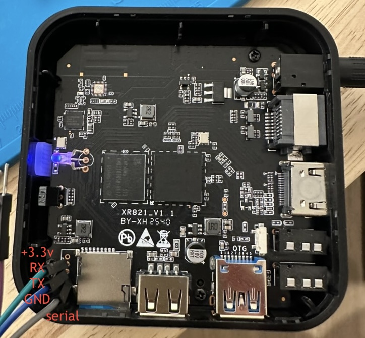

# Armbian for RK35xx TV boxes

Debian on a **$35 RK3518 Android TV box** — silent, fanless, PSU and HDMI cable and IR/Bluetooth
remote included.

Everything board-specific — factory DDR bootloader, device tree, DKMS drivers, boot fixups — is
sideloaded into a stock **[Armbian ROCK 2F](https://www.armbian.com/rock-2f/)** image, which already
runs the RK3528-family kernel. Armbian needs no board of its own, and the result keeps taking kernel
and userspace updates from `apt upgrade` like any supported board.

## Boxes

|            | **R69**                                     | **H96 Max** "H313"                             |
| ---------- | ------------------------------------------- | ---------------------------------------------- |
| Box        |  |  |
| Board      |   |   |
| Board key  | `r69`                                       | `h96max`                                       |
| Silkscreen | `XR821_V1.1`                                | `3518_ZX_V01 20250818`                         |
| SoC        | RK3518                                      | RK3518                                         |
| RAM        | 2 GB (1.5 GB usable)                        | 2 GB                                           |
| eMMC       | 16 GB Samsung                               | 16 GB Micron                                   |
| Wi-Fi / BT | AIC8800D80                                  | Seekwave SWT6621S                              |
| Details    | [board doc][r69]                            | [board doc][h96]                               |

[r69]: docs/r69/board.md
[h96]: docs/h96max/board.md

## What works

Per box, never inherited from the other. ✅ tested here · 🟡 untested · ❌ broken · ➖ not on this
board. Measured numbers behind each ✅ are in the board docs.

| Hardware                                    | R69 | H96 Max |
| ------------------------------------------- | :-: | :-----: |
| **Storage**                                 |     |         |
| eMMC — boot and rootfs                      | ✅  |   ✅    |
| microSD — boot and rootfs                   | ✅  |   ✅    |
| microSD hotplug                             | 🟡  |   🟡    |
| USB 2.0                                     | ✅  |   ✅    |
| USB 3.0 — 5 Gbps, `uas`                     | ✅  |   ✅    |
| USB bus power for a self-spinning drive     | 🟡  |   🟡    |
| **Network**                                 |     |         |
| Ethernet 10/100                             | ✅  |   ✅    |
| Wi-Fi 2.4 GHz                               | ✅  |   ✅    |
| Wi-Fi 5 GHz                                 | ✅  |   ✅    |
| Bluetooth                                   | ✅  |   ✅    |
| Wake-on-LAN                                 | ➖  |   ➖    |
| **Display and video**                       |     |         |
| HDMI video and audio                        | ✅  |   ✅    |
| HDMI 4K60, EDID mode list, hotplug          | 🟡  |   🟡    |
| HDMI-CEC                                    | 🟡  |   🟡    |
| AV jack — composite video and audio         | 🟡  |   🟡    |
| GPU — Mali-450 under lima                   | ✅  |   ✅    |
| Decode H.264 · HEVC · VP9 · MJPEG, to 8K    | ✅  |   ✅    |
| Decode MPEG-2 · MPEG-4 · VP8 · H.263, 1080p | ✅  |   ✅    |
| Encode HEVC · MJPEG · H.264, to 8K          | ✅  |   ✅    |
| AV1                                         | ➖  |   ➖    |
| **Input and indicators**                    |     |         |
| Bundled remote over IR                      | ✅  |   ✅    |
| Bundled remote over Bluetooth, air-mouse    | ✅  |   ✅    |
| Remote voice mic                            | 🟡  |   🟡    |
| IR-extender jack                            | 🟡  |   ➖    |
| Recovery button in the AV jack              | ✅  |   ✅    |
| Power button on the remote                  | ✅  |   ✅    |
| Front LEDs                                  | ✅  |   ✅    |
| **Power and recovery**                      |     |         |
| Suspend to RAM, wake on the remote          | ✅  |   ✅    |
| Hardware watchdog                           | ✅  |   ✅    |
| Serial console                              | ✅  |   ✅    |
| Maskrom recovery over USB                   | 🟡  |   🟡    |

## Build

Needs a **microSD** (8 GB+) and a stock ROCK 2F `.img.xz` (tested: `minimal` vendor 6.1).

```bash
brew install xz coreutils                    # macOS  ·  apt install xz-utils on Debian
./build-e2tools.sh                           # once — stock e2tools corrupts an image on delete
./build-image.sh Armbian_..._Rock-2f_..._minimal.img.xz h96max      # board: r69 | h96max
```

~1 minute, no Docker, no kernel build. Output: `Armbian_..._-<board>.img`.

## Flash and boot

```bash
diskutil list                            # macOS — find the card   ·   lsblk on Linux
diskutil unmountDisk /dev/diskN
sudo gdd if=Armbian_..._-h96max.img of=/dev/rdiskN bs=4M conv=fsync status=progress; sync   # macOS
sudo dd  if=Armbian_..._-h96max.img of=/dev/sdX    bs=4M conv=fsync status=progress; sync   # Linux

ssh root@<box-ip>                        # Armbian default password for root is 1234
```

…or [Balena Etcher](https://etcher.balena.io/). Android is untouched: eject the SD and it boots
again.

> **First boot takes ~5 minutes** and is off the network while DKMS compiles.

## Install to eMMC

**Wipes Android and everything else on that chip.** Boot from SD, dump the chip somewhere durable,
then install — in that order.

```sh
lsblk                                        # the eMMC is the disk with mmcblkXboot0/boot1 beside it
sudo dd if=/dev/mmcblkX bs=4M status=progress | ssh you@host 'cat > emmc-stock.img'

sudo armbian-install                         # choose "Boot from eMMC / system on eMMC"
sudo poweroff                                # pull the SD; it boots from eMMC
```

Dump the **disk**, not partitions. Check `stat -c %s emmc-stock.img` equals
`cat /sys/block/mmcblkX/size` × 512, and keep it off the box and off the SD card.

> **`armbian-install` clears everything below sector 20480** — including vendor storage (`DVKR` at
> 7168, your label `LAN_MAC`) and secure storage (`SSKR` at 8192, HDCP/DRM keys). Current images
> spare that window, older ones do not, and neither store regenerates. Put it back from your dump
> every time; it is a no-op if the installer spared it:
>
> ```sh
> dd if=emmc-stock.img bs=512 skip=7168 count=9216 of=window.bin          # on the host
> sudo dd if=window.bin of=/dev/mmcblkX bs=512 seek=7168 count=9216 conv=notrunc,fsync
> sudo rk35xx-vendor-storage lan                                          # must match the box label
> ```

## No SD slot

A box without a card slot has nothing to boot from, so the backup and the install both go over USB
in maskrom. `docs/maskrom.md` covers it end to end — see its **Write an image over USB**.

## Update a running box

For changes in **this repo** — DTB, drivers, scripts. Everything else: `apt upgrade`.

```bash
./rk35xx-deploy root@<box-ip>     # push this repo and apply  (--reboot if the DTB changed)
sudo rk35xx-update --pull         # …or on the box, fetching the repo itself
```

Installs the payload, rebuilds DKMS, reinstalls the DTB, restarts changed services. Reboots only if
`board.dtb` changed; never touches the bootloader. **Overwrites the files it ships.**

## Remote

IR works unpaired. Bluetooth adds air-mouse and battery. Keycodes vary per remote — read yours with
`sudo evtest /dev/input/ir-remote`.

Pairing mode is **left + right until the LED blinks**; the entry is named **`Bluetooth remote`**.
Pair in **one `bluetoothctl` session with a scan running**, or it fails with
`org.bluez.Error.AuthenticationFailed`:

```sh
sudo apt install bluez            # minimal images ship without it

# 1. remote in pairing mode (LED blinking), then find it by name:
MAC=$(bluetoothctl --timeout 20 scan on | grep -im1 "bluetooth remote" \
      | grep -oE '([0-9A-F]{2}:){5}[0-9A-F]{2}')

# 2. put it back in pairing mode, then pair with the scan running:
{ echo "agent NoInputNoOutput"; sleep 1; echo "default-agent"; sleep 1; echo "scan on"; sleep 8
  echo "pair $MAC";  sleep 20; echo "trust $MAC"; sleep 2
  echo "connect $MAC"; sleep 8;  echo quit; } | bluetoothctl
```

`bluetoothctl remove $MAC` drops the bond, `disconnect` parks it.

> Dead IR means your remote's usercode is not in the DTB's scancode tables — same model name,
> different remotes.

## Serial console

The only view of U-Boot and of any hang before the network. **3.3 V, 1500000 baud.** Both cases open
with a plastic pry tool; the H96 Max needs a couple of screws out to reach the pads from the back.

| Board       | Where                                       | Pinout, `[square pad]` first |
| ----------- | ------------------------------------------- | ---------------------------- |
| **R69**     | 4-pad header beside the SD slot             | **[GND] · TX · RX · 3V3**    |
| **H96 Max** | 3 plated holes between the SD slot and LEDs | **[RX] · GND · TX**          |

- **Adapter:** 3.3 V USB-TTL doing 1.5 Mbaud — **FT232 or CH340**, e.g.
  [Waveshare FT232RNL](https://www.amazon.com/dp/B0CX55K4RG) (~$14). **Not a CP2102** — it cannot do
  1.5 Mbaud and prints plausible garbage.
- **Wiring:** GND, TX, RX only, crossed (box TX → adapter RX). **Never connect 3V3/VCC.**
- **Contact:** no soldering — [test-hook grabbers](https://www.amazon.com/dp/B07BCZSNGS) (~$10).

```bash
brew install tio                                              # or: apt install tio
tio -b 1500000 -L --log-file boot.log /dev/cu.usbserial-XXXX  # macOS: cu.*, not tty.*
tio -b 1500000 -L --log-file boot.log /dev/ttyUSB0            # Linux
```

Power-cycle to see the log; U-Boot's countdown is interruptible. Output but no input: recheck
contact and the TX↔RX crossing. Full kernel log on serial and HDMI: `verbosity=7` in
`/boot/armbianEnv.txt`.

## Recovery

**SD still boots.** Write the backup back over the eMMC:
`sudo dd if=emmc-stock.img of=/dev/mmcblkX bs=4M status=progress; sync`.

**Nothing boots, or the box has no SD slot** — go in over USB: `docs/maskrom.md`, section **Write an
image over USB**.

## Credits

Bring-up method from
[juliovendramini/rk3518_armbian](https://github.com/juliovendramini/rk3518_armbian).

## License

Scripts MIT. The shipped device trees are decompiled from each box's own factory DTB — a hardware
description (register addresses, GPIO routing, clocks) in a layout the DT bindings dictate, carrying
no vendor header or comments. `factory_idbloader.bin` is the vendor's blob; `u-boot.itb` is mainline
U-Boot plus Rockchip's ATF, under their own licenses.
