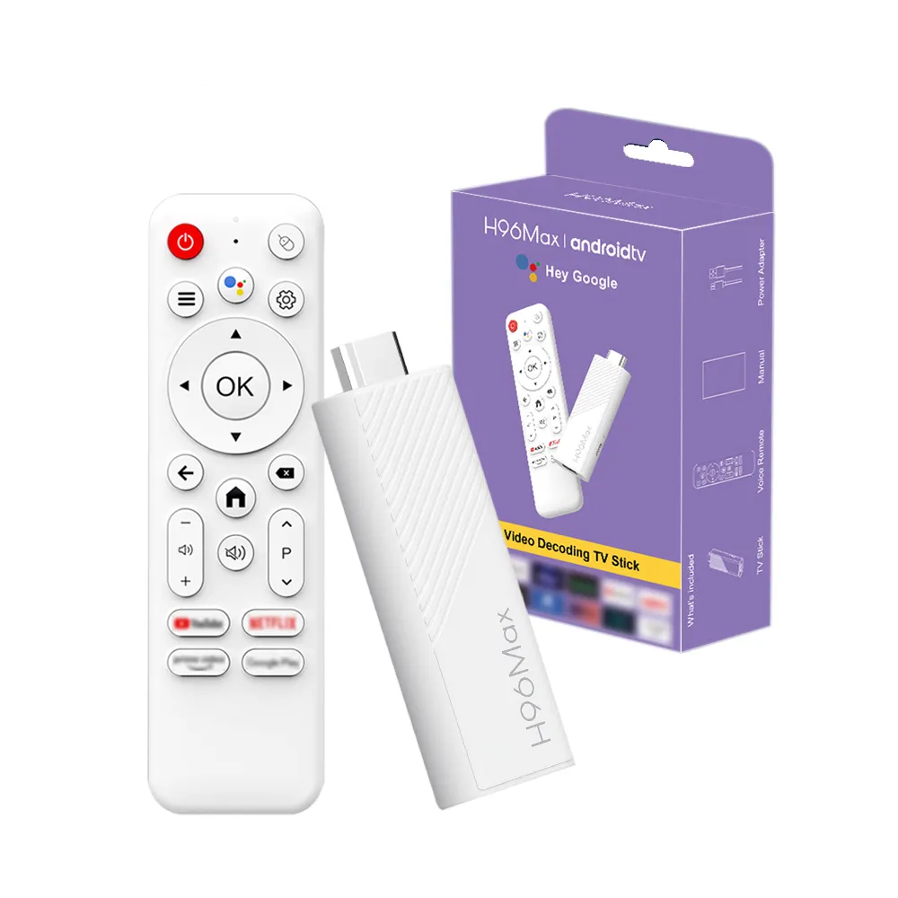
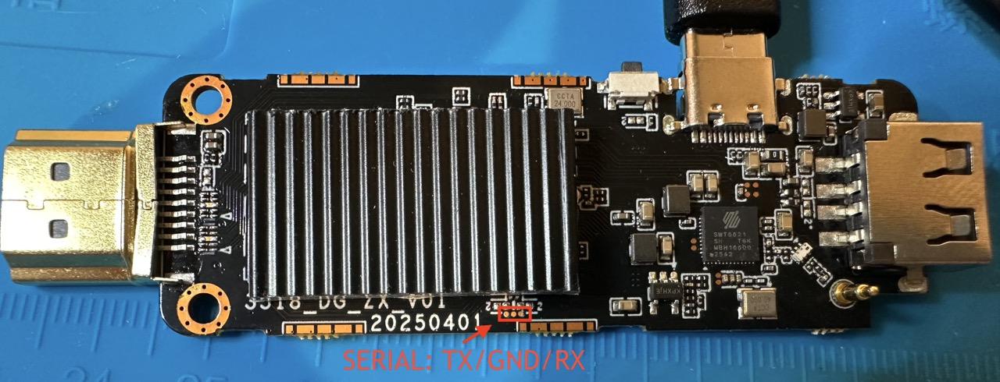

# Armbian for RK35xx TV boxes

Debian on a **$35 RK3518 Android TV box** — silent, fanless, cables and a remote in the box.

A stock Armbian image already runs the RK3528-family kernel, so everything board-specific — factory
bootloader, device tree, DKMS drivers, boot fixups — is sideloaded into it. Nothing is forked, so
`apt upgrade` keeps updating the kernel and userspace.

## Boxes

|            | **R69**                                     | **H96 Max H313**                               | **H96 Max 3518D**                                    |
| ---------- | ------------------------------------------- | ---------------------------------------------- | ---------------------------------------------------- |
| Box        |  |  |  |
| Board      |   |   |   |
| Board key  | `r69`                                       | `h96max`                                       | `h96max-3518d`                                       |
| Silkscreen | `XR821_V1.1`                                | `3518_ZX_V01 20250818`                         | `3518_DG_ZX_V01 20250401`                            |
| SoC        | RK3518                                      | RK3518                                         | RK3518                                               |
| RAM        | 2 GB (1.5 GB usable)                        | 2 GB                                           | 2 GB                                                 |
| eMMC       | 16 GB Samsung                               | 16 GB Micron                                   | 16 GB Micron, **no SD slot**                         |
| USB        | USB-A 3.0 (OTG) + USB-A 2.0                 | USB-A 3.0 (OTG) + USB-A 2.0                    | USB-C 2.0 (OTG) + USB-A 2.0                          |
| Ethernet   | 10/100                                      | 10/100                                         | **none**                                             |
| Wi-Fi / BT | AIC8800D80                                  | Seekwave SWT6621S                              | Seekwave SWT6621S                                    |
| Base image | [Armbian ROCK 2F][rock2f]                   | [Armbian ROCK 2F][rock2f]                      | [Armbian ROCK 2F][rock2f]                            |
| Install    | SD + Maskrom                                | SD + Maskrom                                   | Maskrom only                                         |
| Details    | [board doc][r69]                            | [board doc][h96]                               | [board doc][h96d]                                    |

[r69]: docs/r69/board.md
[h96]: docs/h96max/board.md
[h96d]: docs/h96max-3518d/board.md
[rock2f]: https://www.armbian.com/rock-2f/

## What works

| Mark | Means                                                                |
| :--: | -------------------------------------------------------------------- |
|  ✅  | tested here — the measured number behind it is in that board's doc   |
|  🟡  | likely — a proven mechanism backs it and nothing indicates a problem |
|  ❓  | never tested                                                         |
|  ❌  | broken                                                               |
|  ➖  | not on this board                                                    |

| Hardware                                    | R69 | H96 Max H313 | H96 Max 3518D |
| ------------------------------------------- | :-: | :----------: | :-----------: |
| **Storage**                                 |     |              |               |
| eMMC — boot and rootfs                      | ✅  |      ✅      |      ✅       |
| microSD — boot and rootfs                   | ✅  |      ✅      |      ➖       |
| microSD hotplug                             | 🟡  |      🟡      |      ➖       |
| microSD SDR104 (UHS)                        | ✅  |      ❌      |      ➖       |
| USB 2.0                                     | ✅  |      ✅      |      ✅       |
| USB 3.0 — 5 Gbps, `uas`                     | ✅  |      ✅      |      ➖       |
| **Network**                                 |     |              |               |
| Ethernet 10/100                             | ✅  |      ✅      |      ➖       |
| Wi-Fi 2.4 GHz                               | ✅  |      ✅      |      ✅       |
| Wi-Fi 5 GHz                                 | ✅  |      ✅      |      ✅       |
| Bluetooth                                   | ✅  |      ✅      |      ✅       |
| **Display and video**                       |     |              |               |
| HDMI video                                  | ✅  |      ✅      |      ✅       |
| HDMI audio                                  | ✅  |      ✅      |      ✅       |
| HDMI EDID mode list                         | 🟡  |      🟡      |      ✅       |
| HDMI hotplug re-detect                      | 🟡  |      🟡      |      ✅       |
| HDMI 4K60                                   | 🟡  |      🟡      |      ✅       |
| HDMI-CEC                                    | 🟡  |      🟡      |      ✅       |
| AV jack — composite video                   | ❓  |      ✅      |      ➖       |
| AV jack — analog audio                      | ❓  |      ✅      |      ➖       |
| GPU — Mali-450 under lima                   | ✅  |      ✅      |      ✅       |
| Decode H.264 · HEVC · VP9 · MJPEG, to 8K    | ✅  |      ✅      |      ✅       |
| Decode MPEG-2 · MPEG-4 · VP8 · H.263, 1080p | ✅  |      ✅      |      ✅       |
| Encode HEVC · MJPEG · H.264, to 8K          | ✅  |      ✅      |      ✅       |
| **Input and indicators**                    |     |              |               |
| Bundled remote over IR                      | ✅  |      ✅      |      ➖       |
| Bundled remote over Bluetooth, air-mouse    | ✅  |      ✅      |      ✅       |
| Remote voice mic                            | 🟡  |      🟡      |      🟡       |
| IR-extender jack                            | 🟡  |      ➖      |      ➖       |
| Recovery button → Maskrom                   | ✅  |      ✅      |      ✅       |
| Power button on the remote                  | ✅  |      ✅      |      ✅       |
| Front LEDs                                  | ✅  |      ✅      |      ✅       |
| **Power and recovery**                      |     |              |               |
| Suspend to RAM, wake on the remote          | ✅  |      ✅      |      ❌       |
| Hardware watchdog                           | ✅  |      ✅      |      ✅       |
| Serial console                              | ✅  |      ✅      |      ✅       |
| Maskrom recovery over USB                   | ✅  |      ✅      |      ✅       |

> **Composite needs a kernel Armbian does not ship.** `ROCKCHIP_DRM_TVE` is off in
> `linux-rk35xx-vendor` and the encoder links into `rockchipdrm` rather than a module, so no `apt`
> kernel can drive the AV jack. Analog audio on the same jack works on a stock kernel.
> `docs/todo/rk35xx-cvbs-tve.md` has the rest.

## Build

Needs a stock ROCK 2F `.img.xz` (tested: `minimal` vendor 6.1), and a **microSD** (8 GB+) on the
boxes that have a slot — the rest take the same image over USB, below.

```bash
brew install xz coreutils                    # macOS  ·  apt install xz-utils on Debian
./build-e2tools.sh                           # once — stock e2tools corrupts an image on delete
./build-image.sh Armbian_..._Rock-2f_..._minimal.img.xz h96max   # r69 | h96max | h96max-3518d
```

~1 minute, no Docker, no kernel build. Output: `Armbian_..._-<board>.img`.

## Flash and boot

```bash
diskutil list                            # macOS — find the card   ·   lsblk on Linux
diskutil unmountDisk /dev/diskN
sudo gdd if=Armbian_..._-h96max.img of=/dev/rdiskN bs=4M conv=fsync status=progress; sync   # macOS
sudo dd  if=Armbian_..._-h96max.img of=/dev/sdX    bs=4M conv=fsync status=progress; sync   # Linux

ssh root@<box-ip>                        # Armbian default password for root is 1234
```

…or [Balena Etcher](https://etcher.balena.io/). Android is untouched: eject the SD and it boots
again.

> **First boot takes ~5 minutes** and is off the network while DKMS compiles.

> **No card slot on your box?** Nothing here boots from SD, so skip to [no SD slot](#no-sd-slot).

## Install to eMMC

**Wipes Android and everything else on that chip.** Boot from SD, dump the chip somewhere durable,
then install — in that order.

```sh
lsblk                                        # the eMMC is the disk with mmcblkXboot0/boot1 beside it
sudo dd if=/dev/mmcblkX bs=4M status=progress | ssh you@host 'cat > emmc-stock.img'

sudo armbian-install                         # choose "Boot from eMMC / system on eMMC"

ssh you@host 'dd if=emmc-stock.img bs=512 skip=7168 count=9216' \
  | sudo dd of=/dev/mmcblkX bs=512 seek=7168 conv=notrunc,fsync        # optional, see below
sudo rk35xx-vendor-storage lan                                         # must match the box label

sudo poweroff                                # pull the SD; it boots from eMMC
```

Dump the **disk**, not partitions; `stat -c %s` must equal `/sys/block/mmcblkX/size` × 512. Keep it
off the box and off the SD.

Sectors 7168–16383 hold `DVKR` (the factory `LAN_MAC`) and `SSKR` (HDCP/DRM keys). `armbian-config`
spares them; older versions zero everything below 20480. Neither is needed: without `DVKR`
`rk35xx-mac-pin` derives a stable address instead, and `SSKR` is unreachable under our U-Boot.
Restore only if you want the factory MAC back. `docs/armbian-install.md` has the detail.

## No SD slot

Nothing to boot from, so backup and install both go over USB in Maskrom. Hold the recovery button,
then plug the OTG cable in — the cable powers the box, so the PSU stays out.

**One cable, ordered before you need it:** a [USB-A male-to-male][amm]
(~$4), with a
[USB-C→USB-A female adapter][ca] (~$8 for 4) on whichever end is USB-C. Charge-only
cables enumerate nothing, and a plain USB-C→USB-A cable with the C end in the host does not do OTG
at all.

[amm]: https://www.amazon.com/dp/B0CLB4Y5XD
[ca]: https://www.amazon.com/dp/B0DSK82JK8

```sh
./build-rktools.sh                                 # once -> tools/rktools/
cd tools/rktools

./rkdeveloptool ld                                 # must say Maskrom
./rkdeveloptool db rk3528_spl_loader-<board>.bin   # one loader per board, it carries its DDR init

./rkdeveloptool rfi                                # total sectors, e.g. 30777344
./rkdeveloptool rl 0 <sectors> emmc-stock.img      # back up first
./rkdeveloptool wl 0 <image>                       # then write
./rkdeveloptool rd                                 # reboot
```

`docs/maskrom.md` has the other entry routes, how to verify a dump, and what to do if a transfer
stalls.

## Update a running box

For changes in **this repo** — DTB, drivers, scripts. Everything else: `apt upgrade`.

```bash
./rk35xx-deploy root@<box-ip>     # push this repo and apply  (--reboot if the DTB changed)
sudo rk35xx-update --pull         # …or on the box, fetching the repo itself
```

Installs the payload, rebuilds DKMS, reinstalls the DTB, restarts changed services. Reboots only if
`board.dtb` changed; never touches the bootloader. **Overwrites the files it ships.**

## Remote

IR works unpaired, unless the board has no IR receiver — the stick models do not. Bluetooth adds
air-mouse and battery; read your keycodes with `sudo evtest /dev/input/bt-remote` or
`/dev/input/ir-remote`.

Pairing mode is **left + right until the LED blinks**; the entry is named **`Bluetooth remote`**.
Pair in **one `bluetoothctl` session with a scan running**:

```sh
sudo apt install bluez            # minimal images ship without it

# 1. remote in pairing mode (LED blinking), then find it by name:
MAC=$(bluetoothctl --timeout 20 scan on | grep -im1 "bluetooth remote" \
      | grep -oE '([0-9A-F]{2}:){5}[0-9A-F]{2}')

# 2. put it back in pairing mode, then pair with the scan running:
{ echo "agent NoInputNoOutput"; sleep 1; echo "default-agent"; sleep 1; echo "scan on"; sleep 8
  echo "pair $MAC";  sleep 20; echo "trust $MAC"; sleep 2
  echo "connect $MAC"; sleep 8;  echo quit; } | bluetoothctl
```

## Serial console

The only view of U-Boot and of any hang before the network. **3.3 V, 1500000 baud.** Both cases open
with a plastic pry tool; the H313 needs a couple of screws out to reach the pads from the back.

| Board             | Where                                       | Pinout, `[square pad]` where marked |
| ----------------- | ------------------------------------------- | ----------------------------------- |
| **R69**           | 4-pad header beside the SD slot             | **[GND] · TX · RX · 3V3**           |
| **H96 Max H313**  | 3 plated holes between the SD slot and LEDs | **[RX] · GND · TX**                 |
| **H96 Max 3518D** | 3 tiny round test points, no holes          | **TX · GND · RX**, TX nearest HDMI  |

- **Adapter:** 3.3 V USB-TTL doing 1.5 Mbaud — **FT232 or CH340**, e.g.
  [Waveshare FT232RNL](https://www.amazon.com/dp/B0CX55K4RG) (~$14). **Not a CP2102** — it cannot do
  1.5 Mbaud and prints plausible garbage.
- **Wiring:** GND, TX, RX only, crossed (box TX → adapter RX). **Never connect 3V3/VCC.**
- **Contact:** no soldering where there are holes or a header —
  [test-hook grabbers](https://www.amazon.com/dp/B07BCZSNGS) (~$10). Bare test points give a hook
  nothing to grip: hold a fine probe against the pad, or solder.

```bash
brew install tio                                              # or: apt install tio
tio -b 1500000 -L --log-file boot.log /dev/cu.usbserial-XXXX  # macOS: cu.*, not tty.*
tio -b 1500000 -L --log-file boot.log /dev/ttyUSB0            # Linux
```

Power-cycle to see the log; U-Boot's countdown is interruptible. Output but no input: recheck
contact and the TX↔RX crossing. Full kernel log on serial and HDMI: `verbosity=7` in
`/boot/armbianEnv.txt`.

## Recovery

**SD still boots** — write the backup straight back:
`sudo dd if=emmc-stock.img of=/dev/mmcblkX bs=4M status=progress; sync`.

**Nothing boots, or the box has no SD slot** — go in over USB: `docs/maskrom.md`, section **Write an
image over USB**.

## Credits

Bring-up method from
[juliovendramini/rk3518_armbian](https://github.com/juliovendramini/rk3518_armbian).

## License

Scripts MIT. Device trees are decompiled from each box's factory DTB: a factual hardware description
in the bindings' layout, no vendor header or comments. `factory_idbloader.bin` (vendor blob) and
`uboot.itb` (mainline U-Boot + Rockchip ATF) keep their own licenses.
