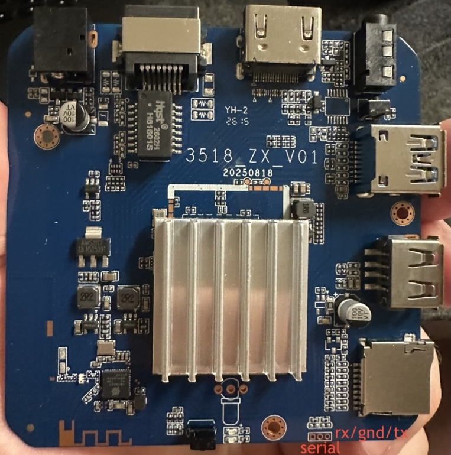

# H96 Max — board details

Retail name "H96 Max H313" — the H313 is branding, the silicon is RK3518.



## Identity — check yours matches before flashing

|               |                                                                                                                                                              |
| ------------- | ------------------------------------------------------------------------------------------------------------------------------------------------------------ |
| Name          | **H96 Max H313** — the model name on the back of the case (LEFFOT). Case plate: `RAM 2GB · ROM 16GB · Input 5V⎓2A`                                           |
| Board         | silkscreen **`3518_ZX_V01 20250818`** — combined RAM+eMMC module, on-PCB Wi-Fi/BT antennas                                                                   |
| SoC           | **RK3518** — `SoC: 35181001` (same ID as the R69)                                                                                                            |
| Label MAC     | **`00:EF:00:4A:43:A6`** ✅ — matches the case label, and held in eMMC vendor storage as `LAN_MAC` (live copy v74); serial `YT26050805378`                    |
| RAM / storage | 2 GB LPDDR3 (**a real 2 GB**) · 16 GB Micron eMMC `R1J96N` (14.7 GiB) · SD card slot                                                                         |
| Wi-Fi / BT    | **Seekwave SV6160LITE** (module **SWT6621S**) — SDIO Wi-Fi 6, BT muxed over the same SDIO link. **Known bug: TX latches at 6 Mbps** — see `wifi-tx-latch.md` |
| Ports         | HDMI · USB 3.0 · USB 2.0 · 10/100 Ethernet · SD slot · AV jack · IR receiver · toothpick button                                                              |
| Remote        | **dual-mode** — works over IR unpaired, and pairs over BLE for air-mouse + battery                                                                           |
| Stock         | Android 14, 32-bit, kernel 6.1.118                                                                                                                           |

Unlike the R69, all 2 GB of RAM is usable here.

**Wake-on-LAN 🟡 impossible here too, untested on this board.** Same integrated FEPHY as the R69
(`ethernet-phy-id0044.1400`, `phy-is-integrated`, no `phy-supply`), and WoL needs the PHY awake
while the MAC sleeps. Proven dead on the R69; 🟡 not ✅ because verification is per-board.

## Measured on our unit

Not a spec — one box, one kernel. If yours lands in the same ballpark, nothing is wrong.

| What              | Result                                                                 |
| ----------------- | ---------------------------------------------------------------------- |
| Ethernet          | **87 Mbit/s goodput** — wire speed for 100FD, both directions          |
| Wi-Fi (5 GHz, ax) | **414 Mbit/s down / 380 Mbit/s up** to a wired peer, −34 dBm           |
| eMMC sequential   | **91.6 MB/s read · 44.0 MB/s write** (read is the HS200 ceiling)       |
| eMMC random 4K    | **3,016 read / 3,783 write IOPS**                                      |
| USB 3 sequential  | **389 MB/s read · 360 MB/s write** — SuperSpeed, UAS, ~18% of one core |
| USB 3 random 4K   | **9,120 read / 8,380 write IOPS** (35.6 / 32.7 MB/s)                   |
| GPU               | **glmark2 41** at 1080p (lima, Mali-450)                               |
| Thermals          | 49 °C idle · **60 °C peak** after 5 min 4-core load (95 °C trip)       |
| Boot              | **~12 s** from eMMC · **18.0 s** from SD (5.3 kernel + 12.7 userspace) |

USB 3 is genuinely SuperSpeed: `5000` Mbps, `uas` not BOT, 389 MB/s sustained for 20 s with no
resets in `dmesg` — 9× what the 480 Mbps ports carry and **4× this box's own eMMC**, at
`usr=1.30%, sys=16.25%`. Same Lexar 128 GB drive as the R69, within 1-2% on every figure, so this is
**the board's ceiling, not the drive's**.

The drive is metal-bodied and **thermally throttles**: a read straight after ~2 GiB of writes plus
30 s of random-write load returned 327 MB/s, and 371 MB/s twice after a few seconds idle.

eMMC over a good SD card is **~6× on random 4K writes** (3,783 vs 623 IOPS) — that is what makes the
box feel quicker after migrating. Sequential gains are milder, and the R69's Samsung part is quicker
still on writes.

## Hardware video

RK3528-class VPU via `/dev/mpp_service` — **8K decode and 8K HEVC encode**, past what the box is
sold as.

**This board needed a device-tree graft to get here.** The factory tree named the SoC only
`rockchip,rk3518`, which no MPP release contains, so the library fell through to "unknown SoC":
every encode died at `could not found coding type` and decode never left the A53s. With
`"rockchip,rk3528a"` appended, MPP reports `match chip name: rk3528a`, dec caps `0x00f0079c`, enc
`0x00100180`.

**Decode ✅ — fps, measured here, 30-frame runs as a normal user:**

| Format |        720p | 1080p |   4K |   8K |
| ------ | ----------: | ----: | ---: | ---: |
| H.264  |       329.5 | 152.8 | 39.7 |  9.6 |
| HEVC   |       605.8 | 326.1 | 85.3 | 20.7 |
| MJPEG  |       521.7 | 292.0 | 91.1 | 23.6 |
| VP9    |       634.2 | 326.7 | 84.8 |   ➖ |
| MPEG-2 |       175.4 |  82.8 |   ➖ |   ➖ |
| MPEG-4 |       197.3 |  93.5 |   ➖ |   ➖ |
| VP8    |       129.6 |  59.7 |   ➖ |   ➖ |
| H.263  | 831.1 (CIF) |    ➖ |   ➖ |   ➖ |

**Encode ✅ — fps:**

| Format |  720p | 1080p |   4K |   8K | Verdict                                        |
| ------ | ----: | ----: | ---: | ---: | ---------------------------------------------- |
| HEVC   | 125.9 |  60.6 | 15.9 |  4.0 | 4K/8K output confirmed real by `ffprobe`       |
| MJPEG  | 323.2 | 172.0 | 49.3 | 12.7 |                                                |
| H.264  | 115.3 |  54.9 | 14.4 |  3.6 | needs MPP >= `905020444`; older returns size 0 |

**AV1** is refused: `unable to create dec av1 for soc rk3528a unsupported`. **AVS / AVS+ / AVS2**
are claimed by the capability word but stay 🟡 — no encoder exists to make a sample clip.

> Two things here contradict MPP's own capability table, which marks this encoder `cap_4k = 0` and
> the decoder 4K: **8K decodes** on all three main codecs, and **HEVC encodes at 4K and 8K**, with
> `ffprobe` confirming genuine `7680x4320` bitstreams rather than downscaled ones.

The R69 measures within noise of every number above — same silicon, so neither box is an outlier.

## Names on disk

Every installed path is `rk35xx-`, the same as every other board: scripts under `/usr/local/sbin/`,
identity under `/usr/local/share/rk35xx/` (`board-id` = `h96max`), and two systemd drop-ins named to
sort last — `logind.conf.d/zz-rk35xx-powerkey.conf` and `system.conf.d/zz-rk35xx-watchdog.conf`.

## LEDs

The two board LEDs are **`power`** (blue) and **`standby`** (red) — running is blue, "off" and
suspend are red, both independently controllable. Other entries in `/sys/class/leds/` come from the
kernel, not this board's tree.

```sh
echo 1 > /sys/class/leds/power/brightness           # on (0 = off)
echo heartbeat > /sys/class/leds/standby/trigger    # pulse (none = back to manual)
```

Early boot briefly shows both LEDs dimly lit, until the kernel driver takes the pins — cosmetic.

## Remote

**Over IR, with no pairing at all** — every button works out of the box. The receiver is input
device `ffa90030.pwm` at the stable path `/dev/input/ir-remote`; scancodes come from
`rockchip,usercode = <0xfb04>` in `firmware/h96max/board.dts`:

| Button            | Key event                                        |
| ----------------- | ------------------------------------------------ |
| Power             | `KEY_POWER`                                      |
| Hamburger (menu)  | `KEY_MENU`                                       |
| Voice (mic)       | `KEY_F14`                                        |
| Cog (settings)    | `KEY_F13`                                        |
| D-pad             | `KEY_UP` / `KEY_DOWN` / `KEY_LEFT` / `KEY_RIGHT` |
| OK (center)       | `KEY_REPLY`                                      |
| Back              | `KEY_BACK`                                       |
| Home              | `KEY_HOME`                                       |
| Backspace         | `KEY_BACKSPACE`                                  |
| Volume +/−        | `KEY_VOLUMEUP` / `KEY_VOLUMEDOWN`                |
| Mute              | `KEY_MUTE`                                       |
| P +/− (channel)   | `KEY_CHANNELUP` / `KEY_CHANNELDOWN`              |
| YT / NF / PV / GP | `KEY_F6` / `KEY_F7` / `KEY_F8` / `KEY_F9`        |
| Mouse             | `KEY_TEXT`                                       |

> **Baseline, not a spec** — _our_ unit's mapping, and these boxes vary between production runs. The
> R69's remote answers to a different usercode (`0xfb05`) with different codes for OK and the app
> row. Check yours with `evtest /dev/input/ir-remote`.

**Over Bluetooth** (optional) adds the **air-mouse** and a battery reading. Pairing mode is **left +
right until the LED blinks** — steady glow first, then the blink; the glow ends once a host
connects. Pair in **one `bluetoothctl` session**: a separate `pair` fails with
`AuthenticationFailed`, as does `--agent` alone.

### Picking it out of a crowded scan

If the `Bluetooth remote` name doesn't show, these narrow it down:

- **Scan before and after** entering pairing mode — the entry that _appears_ is the remote. Never
  guesses wrong.
- **LE Public address.** Phones, watches and earbuds nearly all use rotating LE _Random_ addresses,
  so a public one stands out. `sudo btmgmt find` prints the type; `bluetoothctl` doesn't.
- **Strongest RSSI** with the remote held against the box (−30 dBm range vs −70/−90 across a room),
  and once found, HID `0x1812` + Battery `0x180f` services — nothing else in a living room
  advertises HID.

While BLE-connected the remote stops transmitting IR, so buttons never double-fire; it falls back to
IR when unpaired, which is why the power button still wakes the box from "off". BLE keycodes differ
from the IR ones (home is `KEY_HOMEPAGE`, not `KEY_HOME`), so a keybinding should handle both.

The H96 Max 3518D ships a `hwdb` scancode remap for a remote reporting the same `2B54:1600`. ❓ **It
is deliberately not installed here.** A shared USB id is not a shared button layout, and this
remote's scancodes have never been captured — applying that map blind could mis-key every button.
Capture them first; `docs/remote-keymap.md` has the procedure.

The **voice mic** is out of scope, not broken: the BLE link is up and the button reports
`KEY_SEARCH`, but the audio rides the proprietary Android-TV voice GATT service (`0xfeb3`) rather
than standard BLE audio, so it surfaces neither an ALSA capture device nor a BlueZ transport. That
needs a userspace client for the protocol, not an image builder.

## Watchdog

✅ `/dev/watchdog` appears, systemd takes it, and a deliberate stop-petting test hard-reset this
box.

## Toothpick button

An `adc-keys` input: `KEY_VOLUMEUP` on its own event node, free to remap. Held at power-on it is the
BootROM's maskrom trigger.

## HDMI on a PC monitor

TVs are fine. **PC monitors whose native mode needs a non-standard pixel clock** (e.g. 2256×1504)
show a garbled image with a dotted band and an odd refresh rate: the vendor clock driver synthesizes
only standard HDMI rates. Pin a standard mode:

```sh
# append to extraargs in /boot/armbianEnv.txt, then reboot
video=HDMI-A-1:1920x1080@60
```

This is deliberately **not** baked into the image: it would cap 4K TVs at 1080p.

## Warm reboot is unreliable: dwmmc does not always re-initialise

❌ **The bug (2026-08-15).** `systemctl reboot` on the SD-booted Armbian intermittently never came
back: initramfs retried ~22 times, gave up with `ALERT! UUID=… does not exist`, and only a **power
cycle** recovered it.

🟡 **Partial mitigation: strip `sd-uhs-sdr12/25/50/104` from `mmc@ffc30000`.** The card then runs
plain `high speed SDXC` at 3.3 V, and the SD root failure stopped recurring. The cost is real and
accepted: SDR104 (148.5 MHz, ~70 MB/s rootfs reads) drops to high-speed 50 MHz. **This treats a
symptom, not the cause.**

**The same root cause has a second symptom: no `wlan0`.** On 2026-08-15 a warm reboot came up with
the rootfs fine but no Wi-Fi, because the Seekwave driver gave up waiting for its SDIO card:

```
[SKWSDIO ERROR] skw_sdio_scan_card: wait scan card time out
[SKWSDIO INFO]  skw_sdio_remove_card: sdio_unregister_driver
[SKWSDIO ERROR] skw_sdio_io_init: scan card fail
```

Which symptom appears depends on which `dwmmc` slot loses the race after a warm reset: SD loses and
there is no root, SDIO loses and there is no Wi-Fi. The `sdhci` eMMC is never affected.

❌ **The Wi-Fi half is unmitigated in the shipped image.** Raising the driver's 1 s wait for its
SDIO card to 10 s — enough to cover the mmc core's 400k/300k/200k/minimum retry ladder — did fix it:
**15 consecutive warm reboots** (2026-08-15, 5 + 10 runs), every one a fresh `boot_id`, `wlan0` up,
zero `wait scan card time out`. But that patch was against the Armbian build tree in the now-closed
`armbian/build#10440`. The overlay stages the pinned upstream driver unmodified, and commit
`b1b15016` still waits `msecs_to_jiffies(1000)` in `skw_sdio_scan_card()`. Carrying it here is the
open item in `todo/rk35xx-sd-uhs-warm-reset.md`.

**What the failure actually looked like**, from `verbosity=7` captured via ramoops — note the eMMC
is never affected, and both `dwmmc` controllers stumble while only the SD fails to recover:

```
14.51  mmc0 (SDIO, ffc20000): -110  -> recovers, SDR104 SDIO card
14.58  mmc1 (SD,   ffc30000): -110  -> retries 15.19, 15.81, 16.41 ... never recovers
14.19  mmc2 (eMMC, ffbf0000): fine, HS200
```

**Five candidates were tested on hardware and disproven** — recorded in `dtb.md` so nobody repeats
them: `full-pwr-cycle`, `regulator-boot-on` on `vccio_sd`, `driver_async_probe=dwmmc_rockchip` (the
factory's own cmdline), an `mmc-pwrseq-simple` swap for `vcc_sd`, and simply waiting longer.

**The R69 strips the same properties for a different reason.** It has _no 1.8 V switch at all_
(`vcc_sd` is a fixed 3.3 V rail), so the UHS properties it inherited from the ROCK 2F made the
kernel negotiate 1.8 V signalling the pads cannot do, hanging some cards even at cold boot — there
the strip is a **correctness fix**. This board has a real `vccio_sd` 1.8/3.3 V switch and UHS works
at cold boot, so here it is a **reliability-for-speed trade**.

Still open: why a warm reset leaves `dwmmc` unable to re-initialise while `sdhci` never stumbles. A
driver question, not a device-tree one, and what stands between this board and SDR104 —
`todo/rk35xx-sd-uhs-warm-reset.md`.

## Recovery

❌ **The recovery button does not reach maskrom on `firmware/common/uboot.itb`** — it is an
`adc-keys` entry read by U-Boot, and that FIT has no ADC, so nothing answers it. Fixed by shipping
this board's own FIT. **The OTG port is the USB 3 port.** ✅ Everything past entry is proven — see
the throughput table below. It has an SD slot, so a bad DTB is still recoverable by booting an SD;
otherwise the way in is serial + `ctrl+b`. Procedure in `docs/maskrom.md`.

**Measured over maskrom, 2026-09-12** — one pass each way, all 30777344 sectors, no degradation in
either direction:

| Direction    | Throughput | Full pass                                            |
| ------------ | ---------- | ---------------------------------------------------- |
| read (`rl`)  | 25.4 MB/s  | ✅ 15.76 GB, byte-identical to the 2026-08-07 backup |
| write (`wl`) | 14.6 MB/s  | ✅ 15.76 GB in 1083 s, spot-verified against it      |

The eMMC here is untouched factory Android — Armbian runs from the SD — so that write was a
restore-to-stock, and the box booted clean afterwards with no filesystem errors.

To rewrite the loader pair by hand, **find the eMMC first**: `mmcblk` numbering shifts between
images, and the eMMC is the disk with `boot0`/`boot1` companions.

```sh
EMMC=/dev/$(ls -d /sys/block/mmcblk*boot0 | head -1 | sed 's|.*/||;s|boot0||')
echo $EMMC    # sanity-check: ~16 GB, NOT your SD
```

```sh
for i in 0 1 2 3 4; do   # the BootROM scans five slots 1024 sectors apart
  sudo dd if=firmware/h96max/factory_idbloader.bin of=$EMMC bs=512 \
    seek=$((64 + i * 1024)) count=1024 conv=notrunc
done
sudo dd if=firmware/h96max/uboot.itb of=$EMMC seek=16384 conv=notrunc; sync
```
