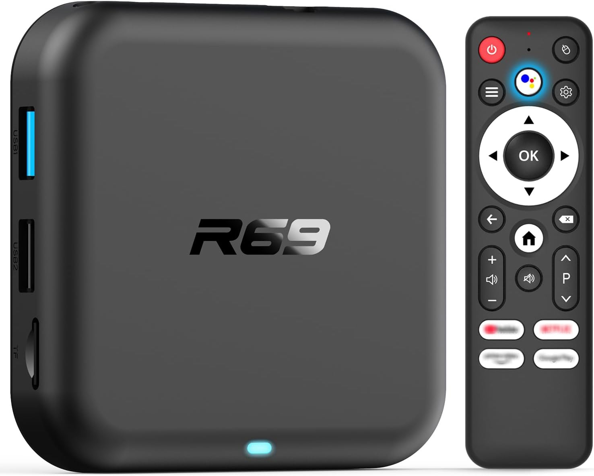

# R69 — board details

Sold as the "R69". Its SoC reports `rk3528` — RK3518 is a variant in that family, which is what
makes a stock ROCK 2F image the right base.



## Identity — check yours matches before flashing

|               |                                                                                                                                                 |
| ------------- | ----------------------------------------------------------------------------------------------------------------------------------------------- |
| Name          | **"R69"** (stock `ro.product.name=R69-1`), Android 14                                                                                           |
| Sold as       | [amazon.com/dp/B0GK8P5YFT](https://www.amazon.com/dp/B0GK8P5YFT) — ~$35 complete with PSU                                                       |
| SoC           | **RK3518A** — `SoC: 35181001`, reports `rk3528` (RK3518 is a variant in the RK3528 family)                                                      |
| RAM / storage | 2 GB DRAM (**~1.5 GB usable** — boot-chain ceiling) · 16 GB Samsung eMMC 5.x (HS200) · microSD                                                  |
| Runs from     | eMMC since 2026-08-09 (`mmcblk2p1`); factory Android overwritten — backup in `backup/r69/`                                                      |
| Label MAC     | **`C4:2A:FE:10:51:77`** — assigned, and held in eMMC vendor storage as `LAN_MAC`                                                                |
| Wi-Fi / BT    | **AIC8800D80** — SDIO Wi-Fi + UART Bluetooth                                                                                                    |
| Ports         | HDMI · USB 2.0 · USB 3.0 · 10/100 Ethernet · microSD · AV jack · IR-extender jack                                                               |
| Remote        | bundled 22-button remote — **dual-mode**: IR unpaired, BLE when paired                                                                          |
| Serial header | 4 pads by the SD slot, **1500000** baud                                                                                                         |
| PCB marking   | `XR821_V1.1` over `BY-XH 2540` — match the **first** line; the second looks like a fab + YYWW date code and will differ between production runs |

## Measured on our unit — not a spec, one box and one kernel

| What             | Result                                                                                                |
| ---------------- | ----------------------------------------------------------------------------------------------------- |
| Ethernet         | **100 Mb/s full duplex** — the hardware ceiling (no gigabit PHY)                                      |
| Ethernet goodput | **94 Mbit/s both ways**, idle and under 4-core load — wire speed, no dip                              |
| eMMC sequential  | **91.6 MB/s read · 74.6 MB/s write** (read is the HS200/100 MHz ceiling)                              |
| eMMC random 4K   | **4,542 read / 4,620 write IOPS**                                                                     |
| SD card read     | **23.4 MB/s** (the card in this box, not a board limit)                                               |
| USB 3 sequential | **389 MB/s read · 360 MB/s write** — SuperSpeed link, UAS, ~22% of one core                           |
| USB 2 sequential | **38.5 MB/s read · 35.6 MB/s write** — 480 Mbps link, usb-storage, 2.4% of a core                     |
| USB 3 random 4K  | **9,185 read / 8,489 write IOPS** (37.6 / 34.8 MB/s)                                                  |
| USB 2 random 4K  | **1,372 read / 1,699 write IOPS** (5.6 / 7.0 MB/s)                                                    |
| CPU thermals     | 44 °C idle · **58 °C** after 5 min 4-core load, no throttling (95 °C trip)                            |
| Boot to login    | **~17 s** from eMMC (~20 s from SD)                                                                   |
| Wi-Fi            | **5 GHz** ch 40, Wi-Fi 6, WPA3-SAE, −51 dBm · also 2.4 GHz (HE, 143/129 PHY); goodput not benchmarked |
| GPU              | **glmark2 score 41** at 2048x1152 — Mali-450 via lima, rendered on a TV                               |

**USB 3 ceiling is the board's, not the drive's.** Same Lexar D50E, blue port, `5000` Mbps, `uas`
not BOT, `sys=19.82%`. Against x86 on the same link: **85 %** of sequential read, **88 %** write,
**76 %** random 4K write — but **98 %** random 4K read, which is latency-bound and therefore the
drive's figure. H96 Max within 1-2 % throughout.

**Ethernet holds wire speed under load** — GMAC runs its NAPI softirqs on four small cores, so this
is the case that usually breaks. `iperf3` on `end0`, idle vs 4-core `stress-ng`: upload 93.9 → 93.7
Mbit/s, download 94.0 both times, no latch, no GMAC errors, 52 °C. Use a **wired** peer: an early
run against a Wi-Fi laptop read 66 Mbit/s and was measuring its radio.

eMMC capped at **HS200/100 MHz** on purpose: HS400ES read ~290 MB/s but corrupted sustained writes,
and the factory caps it the same way. The Samsung part beats the H96 Max's Micron by **70% on
sequential write, ~50% on random-4K read IOPS**; reads match, both on the ceiling.

## GPU

✅ **Renders on screen** — mainline **lima**, `GL_RENDERER: Mali450`, Mesa 25.0.7, OpenGL ES 2.0.

| Scene class                          | FPS                            |
| ------------------------------------ | ------------------------------ |
| texture, bump, gouraud/blinn shading | **61** (vsync-capped at 60 Hz) |
| buffer, ideas, function-low, loop    | 44-49                          |
| phong, conditionals-fragment, shadow | 28-36                          |
| jellyfish, loop-uniform              | 17-19                          |
| effect2d, desktop-blur, refract      | **4-12**                       |
| terrain                              | ➖ unsupported                 |

61 FPS is the 60 Hz panel, not the GPU. `terrain` is silicon:
`GL_MAX_VERTEX_TEXTURE_IMAGE_UNITS is 0`, Mali-400/450 has no vertex texture fetch. Fragment-heavy
scenes are what fall over.

## Hardware video

RK3528-class VPU via `/dev/mpp_service`. **8K decode** and **8K HEVC encode** both work. No
device-tree work needed: the factory tree already says `rockchip,rk3528a`, which `librockchip_mpp`
matches.

**Decode ✅ — fps, measured here, 30-frame runs as a normal user:**

| Format |        720p | 1080p |   4K |   8K |
| ------ | ----------: | ----: | ---: | ---: |
| H.264  |       324.3 | 148.9 | 37.3 |  8.1 |
| HEVC   |       602.8 | 319.3 | 84.8 | 20.0 |
| MJPEG  |       530.9 | 296.8 | 88.9 | 23.7 |
| VP9    |       635.1 | 324.9 | 84.8 |   ➖ |
| MPEG-2 |       177.0 |  83.0 |   ➖ |   ➖ |
| MPEG-4 |       198.7 |  93.5 |   ➖ |   ➖ |
| VP8    |       128.2 |  59.3 |   ➖ |   ➖ |
| H.263  | 801.8 (CIF) |    ➖ |   ➖ |   ➖ |

**Encode — fps:**

| Format |  720p | 1080p |   4K |   8K | Verdict                              |
| ------ | ----: | ----: | ---: | ---: | ------------------------------------ |
| HEVC   | 126.3 |  61.0 | 15.9 |  4.0 | ✅ real 4K/8K confirmed by `ffprobe` |
| MJPEG  | 329.3 | 173.3 | 49.9 | 12.9 | ✅                                   |
| H.264  | 116.3 |  55.0 | 14.4 |  3.6 | needs MPP >= `905020444`             |

**H.264 encode needed an MPP fix, now upstream.** Older MPP never reads the H.264 status register
back, so it sees "not done" and discards a frame the encoder did produce — the `rkvenc` IRQ fires
once per frame throughout. Fixed in `rockchip-linux/mpp` `905020444` (2026-08-10).

**AV1** is refused with `unable to create dec av1 for soc rk3528a unsupported`. **AVS / AVS+ /
AVS2** are claimed by the capability word but stay 🟡 — no encoder exists to make a sample clip.

> The 1080p encode "ceiling" in MPP's own table is wrong for this silicon: `vepu540c` is marked
> `cap_4k = 0`, yet 4K and 8K HEVC both encode and `ffprobe` confirms the real frame size.

**Device nodes ✅.** `/dev/mpp_service`, `/dev/rga` and every `/dev/dma_heap/*` ship root-only
`0600`. `99-rk35xx-vpu.rules` hands them to group `video` — `udevadm test` confirms that rule sets
`GROUP 44`, `MODE 0660` — which is what lets a normal user's player reach the VPU.

## Names on disk

Every installed path is `rk35xx-`, the same as every other board: scripts under `/usr/local/sbin/`,
identity under `/usr/local/share/rk35xx/`, and two systemd drop-ins named to sort last —
`logind.conf.d/zz-rk35xx-powerkey.conf` and `system.conf.d/zz-rk35xx-watchdog.conf`. The R69 carried
an `r69-` prefix until 2026-08-18; `rk35xx-update` removes those on the next run.

## Front LED

The two board LEDs are **`power`** (blue) and **`standby`** (red). A third entry, `mmc2::`, is
registered by the eMMC host (`ffbf0000.mmc`) and is not wired to anything — it is not in our tree.

```sh
echo 1 > /sys/class/leds/power/brightness           # on (0 = off)
echo heartbeat > /sys/class/leds/standby/trigger    # pulse (none = back to manual)
```

## Toothpick button

An `adc-keys` input: `KEY_VOLUMEUP` on `/dev/input/adc-keys`, free to remap. Held at power-on it is
the BootROM's **maskrom trigger**.

## IR remote

The receiver is input device **`ffa90030.pwm`**, reachable at the stable path
**`/dev/input/ir-remote`**; scancodes come from `rockchip,usercode = <0xfb05>` in
`firmware/r69/board.dts`. DKMS rebuilds the driver on kernel updates.

> **Baseline, not a spec** — this is the mapping of _our_ unit, and these boxes vary between
> production runs. The H96 Max's remote answers to a different usercode (`0xfb04`) with different
> codes for OK and the app row. Check yours with `evtest /dev/input/ir-remote`.

| Button                    | Key event                                        |
| ------------------------- | ------------------------------------------------ |
| Power                     | `KEY_POWER`                                      |
| OK (center)               | `KEY_ENTER`                                      |
| Up / Down / Left / Right  | `KEY_UP` / `KEY_DOWN` / `KEY_LEFT` / `KEY_RIGHT` |
| Back                      | `KEY_BACK`                                       |
| Home                      | `KEY_HOME`                                       |
| Delete                    | `KEY_BACKSPACE`                                  |
| Hamburger (menu)          | `KEY_MENU`                                       |
| Cog (settings)            | `KEY_SETUP`                                      |
| Voice                     | `KEY_HELP`                                       |
| Mouse                     | `KEY_TEXT`                                       |
| Volume up / down          | `KEY_VOLUMEUP` / `KEY_VOLUMEDOWN`                |
| Mute                      | `KEY_MUTE`                                       |
| Page up / down            | `KEY_PAGEUP` / `KEY_PAGEDOWN`                    |
| YouTube / Netflix         | `KEY_F6` / `KEY_F7`                              |
| Prime Video / Google Play | `KEY_F3` / `KEY_F8`                              |

**Voice** and **mouse** emit plain key events; their special functions (voice capture, on-screen
cursor) are not wired up over IR.

**Power key: tap suspends, hold powers off — but hold only works over BLE.** The BSP ships
`HandlePowerKey=suspend` + `HandlePowerKeyLongPress=poweroff`, because suspend is both cheaper and
quicker here: 0.3 W and instant, against 0.4-0.5 W and a 17 s cold boot.

| Mode              | Release arrives            | 5 s long press |
| ----------------- | -------------------------- | -------------- |
| **BLE** (paired)  | when you let go            | ✅ works       |
| **IR** (unpaired) | ~2 s in, however long held | ❌ never fires |

Over IR the remote stops repeating after ~2 s; the driver's 130 ms post-repeat timer reports release
and logind runs the short action. Nothing on our side reaches 5 s — `logind.conf` has no duration
setting (systemd hardcodes it) and the driver has no cap. `systemctl poweroff` always works.

**Waking is always IR.** Bluetooth is dead in suspend and off, so only the IR receiver is armed as
an ATF wake source, and the remote falls back to IR when the BLE link drops. Waking therefore needs
line of sight; driving a running box does not.

**BLE pairing ✅.** Hold **left + right** until the LED blinks. Bonds as **`Bluetooth remote`**,
reports battery (97% here), creates `Bluetooth remote Consumer Control`, `Bluetooth remote Mouse`
and a vendor node. BLE keycodes are **not** the IR ones above. Same BLE HID model as the H96 Max's
remote (`usb:v2B54p1600`) despite the different IR usercodes.

## Bluetooth

`minimal` base images ship no `bluez`, and first boot never downloads anything. Install it once,
then re-run the board hook, which configures and starts BT:

```sh
sudo apt install bluez
sudo /usr/local/sbin/rk35xx-firstboot-board
```

**The radio starts soft-blocked without a udev rule.** Rockchip's `rfkill-bt` hardcodes `BT_BLOCKED`
true — the Android model. Nothing else here does it: Wi-Fi on the same chip comes up unblocked, no
in-tree `drivers/bluetooth` driver blocks itself, and the only other callers of
`rfkill_init_sw_state()` are x86 laptop drivers mirroring a physical switch. Symptom: `bluetoothctl`
finds a dead adapter, nothing says why. The BSP's `60-rfkill-bt.rules` fixes it, device-triggered so
it needs no ordering:

```
SUBSYSTEM=="rfkill", ATTR{type}=="bluetooth", ATTR{soft}="0"
```

✅ Simulated a fresh image twice — clear `/var/lib/systemd/rfkill/` (it persists a manual unblock
and hides the problem), `rfkill block bluetooth`, reboot. Both times `bt_default` and `hci0` came up
`soft=0`, `hci0` `UP RUNNING`, `errors:0`, `Powered: yes`, `btmgmt find` 233 devices.

## Ethernet PHY

The integrated RK630 PHY needs OTP calibration — bound to Generic PHY instead, some units drop to 10
Mb/s. The vendor kernel ships `rk630phy`; `/etc/modules-load.d/rk35xx.conf` loads it at boot.

```sh
readlink /sys/class/net/end0/phydev/driver   # want "RK630 PHY", not "Generic PHY"
```

## Watchdog

✅ `/dev/watchdog` appears and the journal says `Using hardware watchdog`. Not stop-petting tested
on this box — that was done on the H96 Max.

## Known gaps

**Wake-on-LAN is impossible here — hardware, not configuration.** WoL needs the PHY awake while the
MAC sleeps. This PHY is **inside the SoC** (`phy-is-integrated`, `ethernet-phy-id0044.1400`, no
`phy-supply`), so deep suspend powers it down and nothing is left listening.

Every software layer was armed anyway: `ethtool end0` → `Wake-on: g`, `power/wakeup` `enabled`,
`stmmac: wakeup enable` at suspend, `eth_wake_irq` already in the MAC node, `RKPM_GMAC_WKUP_EN` bit
8 in the wake matrix. ~10 magic packets, unicast and broadcast, no wake. The
`rockchip,wakeup-config` graft went back to the factory `0x11` — it changed nothing, and a graft
needs a functional consumer. No other board in this BSP sets that bit; the ones where WoL works use
**external** PHYs with their own regulator.

Still open:

- **Never exercised**: **HDMI-CEC**, **HDMI 4K60 / EDID mode list / hotplug re-detect**, honest
  **Wi-Fi throughput** on either band, **USB bus power** for a self-spinning drive, **SD hotplug
  removal**, **the IR-extender jack**, and **A2DP** to a speaker. Each needs a screen, a drive or
  hands on the box.
- **Back-to-stock is unverified.** `backup/r69/emmc-full.img` (15,758,000,128 B) is the only route
  back to Android, and a full restore has never been tested — either `dd` to the eMMC node from an
  SD rescue boot, or maskrom + `rkdeveloptool wl 0`. A **partial** restore is proven: on 2026-08-18
  sectors 7168–16383 were written back from that image after `armbian-install` zeroed them, and
  `DVKR`/`SSKR`/`LAN_MAC` all came back. Identify the eMMC by its `boot0`/`boot1` companions, not a
  remembered number.
- **The BT public address is malformed and cannot be pinned per unit.** `0B:3B:22:AC:88:20` — `0x0B`
  is `0000 1011`, so the **I/G bit is set**, and no SIG member holds `0B:3B:22`. The firmware is
  computing it per-die rather than reading an assigned one. It is at least stable across reboots,
  unlike Wi-Fi's, and `btmgmt public-addr` returns `0x0c Not Supported` — no `set_bdaddr` for the
  generic H4 driver, no known AIC vendor Write-BD_ADDR. A static **LE** address via
  `btmgmt static-addr` does work. Nothing objects in practice: BR/EDR and LE both work, a scan finds
  > 100 devices, and neither the kernel nor `bluetoothd` validates a local controller's address
  > bits. The exposure is **collision**, only with several R69s in range. The route out, if it
  > bites: `HCI_QUIRK_USE_BDADDR_PROPERTY` with `local-bd-address` on the serdev node
  > (`hci_sync.c`), filled per unit by U-Boot from the SoC cpuid.
- **A dark window during cold boot** (cosmetic). The power cycle reads off → red, booting → dark,
  running → blue; the SoC reset clears the GPIOs and `leds-gpio` only re-drives blue when it probes
  ~10–15 s in. Filling it would mean driving an LED from U-Boot, which we do build ourselves.

## Recovery

✅ **Maskrom is proven end to end** (2026-09-12), on this board's own `uboot.itb`. The **recessed
button inside the AV jack**, held _before_ power reaches the box, lands in `Maskrom` directly:
U-Boot's `adc-keys` sees it and resets into BootROM download. `db` with `rk3528_spl_loader-r69.bin`,
then `rfi` (30777344 sectors) and `rl` — a read of sector 64 came back byte-identical to
`firmware/r69/factory_idbloader.bin`, and slot A read over USB matched the FIT written over ssh.

❌ **It does not work on `firmware/common/uboot.itb`**, which has no ADC — nothing reads the button.
The button is only as alive as the U-Boot in slot A.

**The OTG port is the USB 3 port.** Use an **A male-to-male** cable; this box has only USB-A ports,
so add an A-female→C adapter at the host end if that host is USB-C only. Modes and the restore
commands are in `docs/maskrom.md`.

**Measured over maskrom, 2026-09-12** — one pass each way, all 30777344 sectors, rate flat
throughout:

| Direction    | Throughput | Full pass                            |
| ------------ | ---------- | ------------------------------------ |
| read (`rl`)  | 27 MB/s    | ✅ 15.76 GB, no degradation          |
| write (`wl`) | 18.4 MB/s  | ✅ 15.76 GB in 858 s, no degradation |

The box booted normally afterwards, with no filesystem errors. Neither direction throttles here;
`docs/maskrom.md` has the pre-flight signal for boards that do.

✅ **The A-to-A cable alone powers the box** — no PSU, through a full 15.76 GB read and write. The
button must still be held **before** power reaches it, whatever supplies it.

To rewrite the loader pair by hand, **find the eMMC first**: `mmcblk` numbering shifts between
images, and the eMMC is the disk with `boot0`/`boot1` companions.

```sh
EMMC=/dev/$(ls -d /sys/block/mmcblk*boot0 | head -1 | sed 's|.*/||;s|boot0||')
echo $EMMC    # sanity-check: ~16 GB, NOT your SD

for i in 0 1 2 3 4; do   # the BootROM scans five slots 1024 sectors apart
  sudo dd if=firmware/r69/factory_idbloader.bin of=$EMMC bs=512 \
    seek=$((64 + i * 1024)) count=1024 conv=notrunc
done
sudo dd if=firmware/common/uboot.itb          of=$EMMC seek=16384 conv=notrunc; sync
```

> **Images built before August 2026 soft-brick on `armbian-install`**
> ([#6](https://github.com/sormy/rk35xx-tvbox-armbian/issues/6)) — stock `armbian-install` writes
> the generic ROCK 2F loaders, which lack this box's DDR tuning. Current images override
> `write_uboot_platform` so every bootloader write uses the R69 pair. On an older image, run
> `rk35xx-update` **before** migrating.
